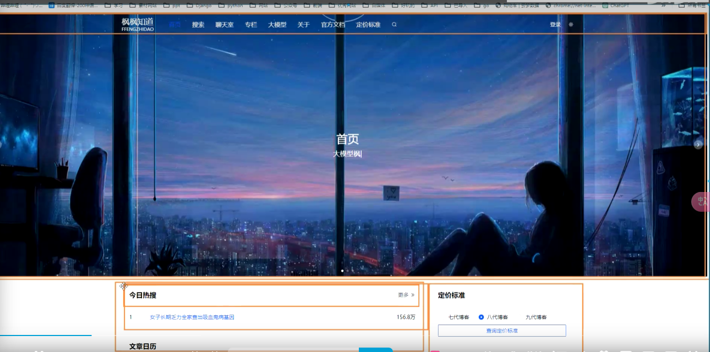

# 层叠样式表 CSS （Cascading Style Sheets）

- HTML定义内容的 **结构和语义**

- CSS用于设计 **风格和布局**

## 引入方式

1. 外部
2. 内部
3. 行内样式

```html
<!DOCTYPE html>
<html lang="en">
<head>
    <meta charset="UTF-8">
    <title>引入css</title>
<!--    内部样式-->
    <style>
        h2{
            color: aqua;
        }
    </style>

<!--    外部引入 rel为relationship -->
    <link rel="stylesheet" href="try.css">
</head>
<body>
<!--行内样式-->
<div style="color: red;font-size: 20px">hello,world</div>

<!--内部样式-->
<h2>hello</h2>

<!--外部引入-->
<h3>world</h3>
</body>
</html>
```

css

```css
h3{
    color: blue;
}
```

## 如何理解层叠

- 优先级（权重） 

- 同级后面的覆盖前面


# 选择器

## id选择器

 CSS 中 id 选择器以 "#" 来定义

 ID属性不要以数字开头，数字开头的ID在 Mozilla/Firefox 浏览器中不起作用

 ```css
 #para1
 {
     text-align:center;
     color:red;
 }
 ```


## class选择器

在 CSS 中，类选择器以一个点 **.** 号显示

```css
.center {text-align:center;}
```

[枫枫知道个人博客 (fengfengzhidao.com)](https://www.fengfengzhidao.com/special/2/27)属性选择器[href]、标签选择器、通用选择器

# 盒模型




## 盒子宽度模式

通过修改boxsizing来进行盒子模式的修改

默认的设置为content的限制，加入这一行后为border的大小，一般通过通用选择器设置

```
* {box-sizing: border-box;}
```

## dispaly

none：不显示

block：块盒，上下的margin会合并

inline：行盒，width设置无效

inline-block：行内块

## padding

```css
padding-left: 20px;
padding-top: 10px;
padding-right: 20px;
padding-bottom: 10px;
```

## margin设置

基本设置同padding类似

但是margin有auto属性 学flex的时候再说

## border设置

可以单独设置每个边的边框

边框属性有宽度，线段类型，颜色

```css
border-width
border-style
border-color
```

solid   实线 dashed  虚线 dotted  点线 double  双实线

需要什么样的三角形，就让其他的三角形颜色是透明的 `transparent`


## outline 设置

轮廓线，属性和border类似

1. 不占用盒子的宽度
2. 只能设置整个的，没有单个方向的

# css定位

position属性

| 值       | 描述                                                         |
| -------- | ------------------------------------------------------------ |
| absolute | 生成绝对定位的元素，相对于 static 定位以外的第一个父元素进行定位。元素的位置通过 “left”, “top”, “right” 以及 “bottom” 属性进行规定。 |
| fixed    | 生成固定定位的元素，相对于浏览器窗口进行定位。元素的位置通过 “left”, “top”, “right” 以及 “bottom” 属性进行规定。 |
| relative | 生成相对定位的元素，相对于其正常位置进行定位。因此，“left:20” 会向元素的 LEFT 位置添加 20 像素。 |
| static   | 默认值。没有定位，元素出现在正常的流中（忽略 top, bottom, left, right 或者 z-index 声明） |
| sticky   | 粘性定位。根据用户的滚动位置进行定位。                       |

## 固定定位

相当于网页的**导航栏**等，最上面

1. 脱离文档流
2. 以浏览器为参照

## 相对定位

**相对自己的正常位置进行变化**，距离位置（left\bottom）的距离

1. 相对元素之前的位置
2. 之前的位置还在文档流中
3. 

## 绝对定位

1. 脱离文档流
2. 找父级非static的元素进行偏移，找不到就层层往上，直到body


