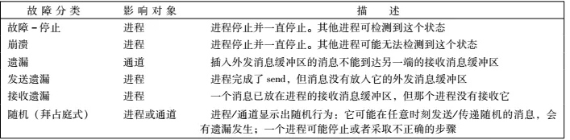

# Fault Tolerant Virtual Machinese

## Abstract

通过在另一个服务器上的备用虚拟机复制 主虚拟的的操作 来完成

## 1. INTRODUCTION

主备份方法

>  使用备份服务器接管主服务器

+

Statemachine Approach 状态机

> 从相同的状态启动，并保持请求一致

物理机实现状态机较为困难，但是 虚拟机 可以通过hypervisor实现所有信息的监控

容错的实现方式被称为 deterministic replay

对虚拟机的故障检测为 Fault-stop failures，[《分布式系统：概念与设计》一2.4.2　故障模型-阿里云开发者社区 (aliyun.com)](https://developer.aliyun.com/article/174386)

## 2. BASIC FT DESIGN

两个虚拟机是虚拟同步的，虚拟机的虚拟磁盘位于共享存储上

主机和备份VM遵循特定的协议，包括备份VM的[显式确认]([ospf的显示确认和隐式确认_mb5ece6082aa10d的技术博客_51CTO博客](https://blog.51cto.com/u_14827054/9533569))，以确保主故障时没有数据丢失

为了检测主或备份VM是否失败，我们的系统使用相关服务器之间的心跳和日志记录通道上的流量的组合。此外，我们必须确保只有一个主服务器或备份虚拟机接管执行，即使存在主服务器和备份服务器彼此失去通信的脑裂情况。

### 2.1 Deterministic Replay Implementation

 3个挑战

1. 正确捕获所有的输入和不确定性
2. 正确应用输入和不确定性备份虚拟机
3. 不会降低性能

Deterministic Replay  即生成 日志文件，保存有所有deterministic 或者non-deterministic 操作，稍后在备份上重演
event delivery mechanism

### 2.2 FT Protocol

日志文件不写入磁盘，而是通过日志通道直接传给备份机，因此备份机的执行方式与主机相同

但是在日志通道需要严格的FT Protocol 确保在主机故障时 从机能够 通过主机相同的方式输出到客户端

只要备份VM满足输出要求，

在故障转移到备份VM时，就不会有外部可见的状态或数据丢失，

客户端也不会注意到其服务中的中断或不一致。

[分布式消息队列详解：10min搞懂同步和异步架构等问题 - 个人文章 - SegmentFault 思否](https://segmentfault.com/a/1190000019411260)

在备份VM接收到并确认与生成输出的操作关联的日志项之前，主VM可能不会向外部世界发送输出。

还需要网络等的协同？

### 2.3 Detecting and Responding to Failure

解决脑裂

>  通过在 虚拟共享内存 进行 原子操作，让server知道是否有其他server使用这个操作集，如果有，则自杀，如果没有，则成为primary

## PRACTICAL IMPLEMENTATION of FT

### 3.1 Starting and Restarting FT VMs

不使用clone而是迁移

FT会选择合适的server来创建备份机

### 3.2 Managing the Logging Channe

主备份的缓冲 —尽快被冲刷到–logging channel—尽快—- 从备份的缓冲

从机每次将log entries读到缓冲，就像主机报告

为了防止主备份的缓冲满，会调整主机的CPU占用率

### 3.3 Operation on FT VMs

显示explicitly shut off关闭不会让备份上线 

Vmotion的相关信息，主机和从机的Vmotion相比不同Vmotion都有所不同

### 3.4 Implementation Issues for Fisk IOs

