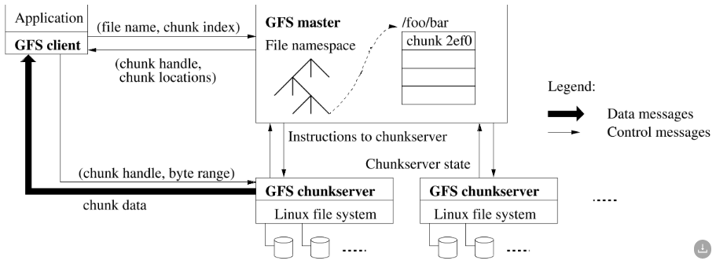
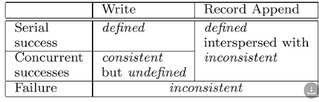
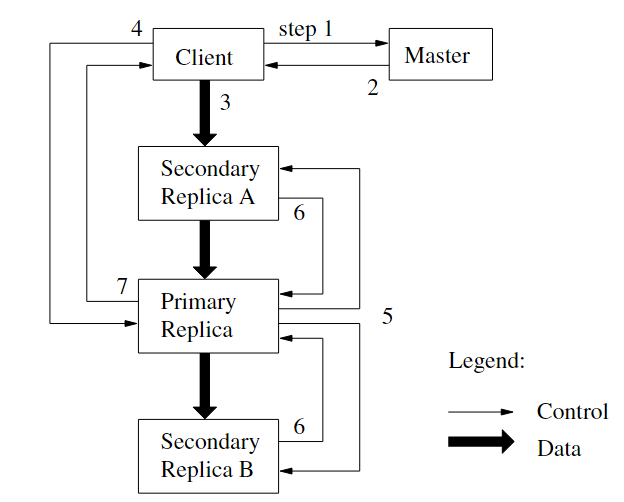

# GFS

## 绪论

可拓展分布式文件系统

- 容错
- 高聚合性能

需要实现的关键点：

1. 错误恢复

2. 对文件操作的审视 I/O操作的定义
   文件大小较大

3. 对文件的操作通常都是读取，或者是（写入）插入在文件的末尾

4. 应用程序和文件系统API一同设计

   ## 概述

   ### 假设

   - 文件读取

     - 大型流式读取

     - 小型随机读取

   - 写入

   - 系统具有原子性

   - 高持续带宽 大于 低延迟

### 接口

create

delete 

open 

close

read 

write

snapshot

record

###  结构

- master	一个
  记录文件树,存储 元数据

  > namespcae
  >
  > access control information
  >
  > mapping from files to chunks
  >
  > current locations of chunks

  系统范围内活动

  通过heartBeat消息收集chunkserver状态并分配任务

- chunkserver 多个
  保存文件
  写入读取依靠 **句柄**chunk handle **范围** byte range

**文件chunk的标识 ****chunk handle** 是创建时在 主服务器分配的，

文中默认保存 3 个副本

client与master和chunkserver都有沟通，三者直接联系 ，没有中间媒介

### 2.4 单个 master

不参与读写，master不是瓶颈

客户端client 向 master 询问 应该请求哪个 chunkserver

### 2.5 chunk Size 块大小

文中为64MB

**Big Size的优势**

- 减少了client和master交互的次数
- client在一个大的chunk上可能进行更多操作，再减少交互
- 节省了master的元数据存储，方便存储到内存上

**big Size 的劣势**

- 出现热点问题hot spots

### 2.6 Metadata 

存储三种主要信息

1. 文件、块名称 namespace
2. 文件到块的映射 mapping
3. 块副本的位置 locations

所有元数据都保存在主内存中

前两种类型(名称空间和文件到块映射)也通过将更改记录到存储在主服务器本地磁盘上并复制到远程机器上的操作日志中来保持持久化。

主服务器不持久化存储块位置信息。相反，它会在主启动时以及每当有chunkserver加入集群时询问每个chunkserver的块。

> 这样可以在集群增加或减少chunkserver时不用和master保持一致，master直接查询即可

#### operation log

它不仅是元数据的唯一持久记录，而且还用作定义并发操作顺序的逻辑时间线。

在元数据更改持久化之前，不能使更改对客户机可见。

在日志记录刷新到磁盘后才相应client

定时或者在一定操作量后**自动保存检查点**，方便回放操作

checkpoints存储形式B-tree

### 2.7 Consistency Model

#### Guarantees

文件命名空间namespaces为原子操作

文件区域状态有consistent和inconsistent

并发成功的突变使区域未定义，但保持一致:所有客户端都看到相同的数据，但它可能不反映任何一个突变所写的内容。

相同顺序执行操作
使用块版本号来检测是否错过突变

## System Interactions

三种操作

- data mutations 数据突变
- atomic record append 原子记录追加
- snapshot 快照

### 3.1 Leases and Mutation Order

突变mutation是一种改变数据块内容或元数据的操作，例如写操作或追加操作。在所有的chunk副本运行

> 我们使用leases租约来维护副本间一致的mutations顺序

主服务器将块租期授予其中一个副本，我们称之为primary

lease租约的默认超时为60s，但是可以续约。在HeartBeat包中包含相关内容

### 3.2 Data Flow

为了尽可能利用带宽，选择线性链传输，而不是并发传输

> 每台服务器将数据传输给最近的服务器

每台服务器的接收和发送是同时的

在没有网络拥塞的情况下，将 B 字节传输到 R 个副本的理想运行时间为 B/T + RL，其中 T 是网络吞吐量，L 是在两个机器之间传输字节的延迟。我们的网络链接通常为 100 Mbps (T)，L 远低于 1 ms。因此，理想情况下，1 MB 可以分布在大约 80 毫秒内

### 3.3 Atomic Record Appends

没太看明白，与传统的写入有什么不同，怎么实现的呢？

### 3.4 Snapshot

快照操作几乎是立即生成文件或目录树(“源”)的副本

## Master Operation

主节点执行所有命名空间操作。此外，它管理整个系统的块副本:它做出放置决策，创建新的块和副本，并协调各种系统范围的活动以保持块完全复制，平衡所有块服务器之间的负载，并回收未使用的存储。

### 4.1 Namespace Management and Locking

在命名空间Namespace上使用锁来保证并发序列化

GFS逻辑上将其名称空间表示为将完整路径名映射到元数据的查找表

### 4.2 Replica Placement

块副本放置策略有两个目的:最大限度地提高数据的可靠性和可用性，最大限度地提高网络带宽利用率

跨机架分布副本

### 4.3 Creation, Re-replication, Rebalancing

如何平衡防止chunk server中的chunk

只要可用副本的数量低于用户指定的目标，主服务器就会重新复制一个块。发生这种情况的原因有很多:chunkserver不可用，报告其副本可能损坏，其中一个磁盘因错误而禁用，或者增加了复制目标。需要重新复制的每个块根据几个因素确定优先级。一个是它离复制目标有多远。例如，我们给予丢失两个副本的块比只丢失一个副本的块更高的优先级。此外，我们更倾向于首先重新复制活动文件的块，而不是属于最近删除的文件的块(参见章节4.4)。最后，为了尽量减少故障对正在运行的应用程序的影响，我们提高了阻塞客户机进程的任何块的优先级。

### 4.4 Garbage Collection

文件删除后，GFS不会立即回收可用的物理存储。它仅在文件和块级别的常规垃圾收集期间惰性地执行此操作。我们发现这种方法使系统更简单，更可靠。

用户也可以指定立即删除的目录

### 4.5 Stale Replica Detection

对于每个块，主服务器维护一个块版本号，以区分最新副本和过期副本

## 诊断和容错 Tolerance Diagnosis

### 5.1 High Availability

shadow master 

5.1.1 Fast Recovery

5.1.2 Chunk Replication

5.1.3 Master Replication

### 5.2 Data Integrity

每个chunkserver使用校验和来检测存储数据的损坏。

校验和计算在很大程度上优化了附加到块末尾的写操作(而不是覆盖现有数据的写操作)，因为它们在我们的工作负载中占主导地位。我们只是增量地更新最后一个部分校验和块的校验和，并为任何由追加部分填充的全新校验和块计算新的校验和。

### 5.3 Diagnostic Tools

通过log来完成的吗？

##  MEASUREMENTS
