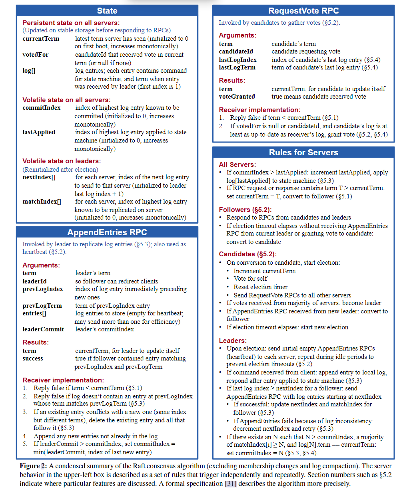
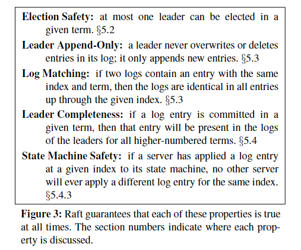
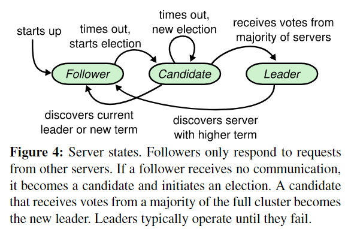
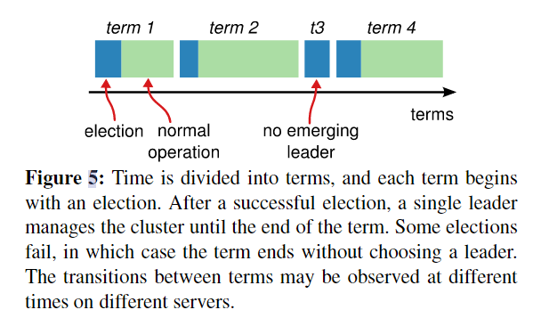

# In Search of an Understandable Consensus Algorithm (Extended Version)

# Abstract

Raft is a consensus algorithm for managing a replicated log.

 

key elements of consensus

- leader election
- log replication
- safety

includes a new mechanism for changing the cluster membership

# 1.Introduction

共识算法允许一组机器作为一个连贯的组工作，可以在其一些成员的故障中存活下来

why

1. understandability
2. practical

AD

1. <a href="#这是你的锚点">decomposition</a>
2. state space reduction
   用于复制状态机？

features

• **Strong leader**: Raft uses a stronger form of leadership than other consensus algorithms. For example, log entries only flow from the leader to other servers. This simplifies the management of the replicated log and makes Raft easier to understand.

• **Leader election**: Raft uses randomized timers to elect leaders. This adds only a small amount of mechanism to the heartbeats already required for any consensus algorithm, while resolving conflicts simply and rapidly.

• **Membership changes**: Raft's mechanism for changing the set of servers in the cluster uses a newjoint consensus approach where the majorities of two different configurations overlap during transitions. This allows the cluster to continue operating normally during configuration changes.

# 2.Replicated state machines

共识算法consensus algorithm 常用于 复制状态机replicated state machines

些许复制状态机的知识

# 3. What's wrong with Paxos

1. difficult to understand
2. don't provide a  good foundation

# 4.Designing for understandability

**understandability**

two techniques

1.  <a href="#这是你的锚点">separate</a>
2. simplify the state space
   引入随机化（用于leader election）等

# 5.The Raft consensus algorithm

Raft 通过首先选举一个有区别的领导者来实现共识，然后让领导者完成管理复制日志的责任

领导者接受来自客户端的日志条目，在其他服务器上复制它们，并告诉服务器何时可以安全地将日志条目应用于他们的状态机

## 5.1 Raft basics

典型 服务器数量：5，可以容忍2 个错误

**三个状态**

1. leader
   领导者处理所有客户端请求（如果客户端接触跟随者，跟随者将其重定向到领导者）
2. follower
   追随者是被动的：他们自己没有请求，而是简单地响应领导者和候选人的请求。
3. candidate
   第三个状态候选，用于选举一个新的领导者，如下所述Figure 4

**term**
每个term只有一个leader

> term在Raft中充当逻辑始终logical clock，每个服务器存储器信息
>
> term有对应的term number，单调递增
>
> 每当服务器通信时，都会交换当前条款;如果一台服务器的当前项小于另一台服务器的，则将其当前项更新为较大的值。如果候选人或领导者发现其任期已过，则立即恢复为追随者状态。如果服务器接收到一个带有过期术语号的请求，它将拒绝该请求。

**rpc**
Raft服务器使用远程过程调用(rpc)进行通信，基本的一致性算法只需要两种类型的rpc。

> RequestVote rpc由候选人candidate在选举期间发起(章节5.2)，
>
> AppendEntries rpc由领导者leader发起，以复制日志条目并提供心跳形式heartbeat(章节5.3)。

第7节添加了第三个RPC，用于在服务器之间传输快照。如果服务器没有及时收到响应，它们会重试rpc，并且它们会并行地发出rpc以获得最佳性能。

## 5.2 Leader election

 

使用heartbeat mechanism 来触发 leader 选举

