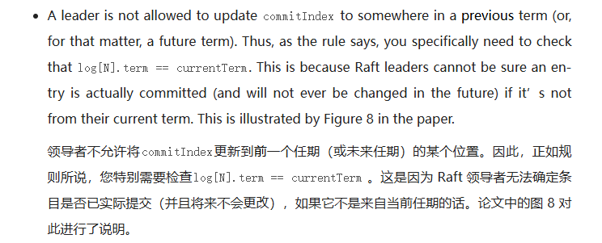

# 重走西游

由于在进行代码的书写前 对 框架整体 没有建立完全的认识，导致在建立的时候东一笔，西一笔，最终写出来的程序十分混乱，各种重复代码满天飞，并在维护的最后由于个人能力的不足导致lab2C的失败，由此只能 归零 ，重新进行实验编写。

# 问题回顾

## 是什么导致了最后的崩溃

由于在test3C的figure8（unreliable）的过程中，设定网络不稳定，导致leader和follower在committedIndex之间存在不一致，导致最后apply的日志出现冲突

> 怎么解决？
>
> 1. 如何判定什么时候该发送apply的日志
>
>    > committedIndex
>    >
>    > lastApplied
>
> 2. 怎么确保leader和followercommittedIndex一致？
>
>    > 必须有中间状态，两边达成一致时才能写进formal committedIndex
>    >
>    > leader接受信息
>    >
>    > 大部分follower接收到信息
>    >
>    > leader temp committed 增加
>    >
>    > follower看到leader的temp committed增加，自己 formal committed增加
>    >
>    > leader看到follower的temp committed增加，自己 formal committed增加
>    >
>    > > 导致的committed 不一致怎么办？
>
> 3. apply检测到二者的committed？真能吗？

我是傻逼！！

TMD要整理api出去，全都写在一个大function中，成何体统！？

[官方建议]([实验室指导 --- Lab guidance (mit.edu)](https://pdos.csail.mit.edu/6.824/labs/guidance.html))

学习一下别人的思路

#  实现

在上一版中，我错误地预估了自己的实力，在还没有日志压缩的时候加入很多不必要的冗余，对于实力较弱的我来说有害无益

发送RPC需要重复发送吗？
