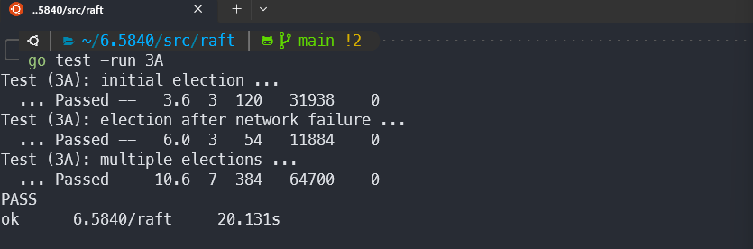

需要实现
saving persistent state and reading it after a node fails and then restarts
log compaction / snapshotting (Section 7)

不需要
section6—change membership

[Students' Guide to Raft :: Jon Gjengset (thesquareplanet.com)](https://thesquareplanet.com/blog/students-guide-to-raft/)

[nil.csail.mit.edu/6.824/2020/labs/raft-locking.txt](http://nil.csail.mit.edu/6.824/2020/labs/raft-locking.txt)

[nil.csail.mit.edu/6.824/2020/labs/raft-structure.txt](http://nil.csail.mit.edu/6.824/2020/labs/raft-structure.txt)


## 2A task

- leader election
- heartbeats （AppendEntries RPCs with no entry）


### 遇到的困难

1. 不知道怎么处理心跳的问题

> 网上大多使用**time.timer**进行计时，但是在lab的hint中已经写不推荐使用。（虽然这个方法也不会）
>
> 使用**time.sleep**该怎么解决，之前没用使用过，不知道如何**重置**

<a href="#心跳问题">解决</a>

2. 为啥RequestVote RPC中Results包含term，有什么作用？

   > 在 `RequestVoteReply` 中，`term` 参数虽然是由 `follower` 返回给 `candidate` 的，但它仍然非常重要。原因如下：
   >
   > ### 1. **检测并纠正过期的候选者**
   >
   > 当一个 `candidate` 请求选票时，它可能处于一个较旧的 `term`。如果 `follower` 处于一个更新的 `term`（即 `follower` 的 `term` 大于 `candidate` 的 `term`），`follower` 会拒绝投票，并在 `RequestVoteReply` 中返回它的当前 `term`。
   >
   > - 当 `candidate` 收到这个带有较新 `term` 的 `RequestVoteReply` 时，它会意识到自己落后了，并更新自己的 `term` 为这个更大的值。根据 Raft 协议，一旦 `candidate` 发现有服务器的 `term` 比它自己大，它会立即放弃竞选，回退到 `follower` 状态。
   >
   > ### 2. **避免网络分区引发的过期领导问题**
   > 在分布式系统中，网络分区或其他原因可能导致某些服务器的 `term` 落后。通过让 `follower` 返回它的当前 `term`，可以防止过期的 `candidate` 继续尝试获取选票，避免产生多个领导者的情况，确保集群的正确性和一致性。
   >
   > ### 3. **同步集群状态**
   > 通过这种机制，所有服务器能够逐渐收敛到一致的 `term`，从而避免了因 `term` 不一致引发的潜在问题。在 Raft 中，`term` 是确保系统在面对网络分区或故障时仍然保持一致性和正确性的重要部分。
   >
   > ### 小结
   > 虽然 `candidate` 在发送 `RequestVote` 请求时有自己的 `term`，但 `follower` 返回的 `term` 提供了一种机制，使 `candidate` 能够发现并更新它的 `term`，从而避免产生多个领导者并确保集群的状态一致性。

### 解决困难

1. 心跳问题<a id="心跳问题"></a>

   > 虽然不推荐使用，这里还是学习以下time.timer怎么使用
   >
   > [wlwilliamx | Go Timer 详解以及 Reset 和 Stop 的详细用法](https://wlwilliamx.github.io/posts/go-timer-详解以及-reset-和-stop-的详细用法#reset-重置-timer)

   [Raft 算法选主详解与复现, 完成 MIT 6.824(6.5840) Lab2A - 掘金 (juejin.cn)](https://juejin.cn/post/7286133122211037244#heading-21)当然，在别人的尝试里面time.sleep的时间戳的做法会出错，这里还需要实验验证

   > 正经版，time.sleep相关的重置
   >
   > [Golang time.Sleep()函数及示例|极客教程 (geek-docs.com)](https://geek-docs.com/go-tutorials/go-examples/g_time-sleep-function-in-golang-with-examples.html)

查找资料过程中，还有time.after相关，可以直连channel，但是助教不推荐channel。不太明白


到底哪些函数需要锁？


在for 中使用闭包函数的传入问题，在使用过程中一直对同一follower发送投票请求

> 如下例：
> ```go
> func main() {
>     for i := 0; i < 3; i++ {
>         //i:=i
>         go func() {
>             fmt.Println(i)
>         }()
>     }
>     time.Sleep(time.Second)
> }
> 
> ```
>
> 他的输出实际为333，当闭包函数执行时，闭包中i已经被更新到3了
> 所以应该使用i：=i，如注释，以传递副本保证值的正确


### 重新整理问题

candidate和follower有什么本质区别？

> 先不谈后面，在2a（6.5840中为3a）中follower超时自动变为candidate，我在rf设为指认leader，后续有需要再改


心跳超时
大家都一样

 选举超时 
每次都初始化


子函数中创建的 goroutine **不会**随着子函数的结束而结束。goroutine 是独立执行的，并且在创建后，它的生命周期与创建它的函数无关。同时，锁也不会跟进到goroutine中


## 结果：



存在data race，有问题的话之后再改吧

源代码：仅供借鉴，有需要的可以看看，给博主提供修改意见

```go
package raft

//
// this is an outline of the API that raft must expose to
// the service (or tester). see comments below for
// each of these functions for more details.
//
// rf = Make(...)
//   create a new Raft server.
// rf.Start(command interface{}) (index, term, isleader)
//   start agreement on a new log entry
// rf.GetState() (term, isLeader)
//   ask a Raft for its current term, and whether it thinks it is leader
// ApplyMsg
//   each time a new entry is committed to the log, each Raft peer
//   should send an ApplyMsg to the service (or tester)
//   in the same server.
//

import (
	//	"bytes"
	"math/rand"
	"sync"
	"sync/atomic"
	"time"
	//	"6.5840/labgob"
	"6.5840/labrpc"
)

// as each Raft peer becomes aware that successive log entries are
// committed, the peer should send an ApplyMsg to the service (or
// tester) on the same server, via the applyCh passed to Make(). set
// CommandValid to true to indicate that the ApplyMsg contains a newly
// committed log entry.
//
// in part 3D you'll want to send other kinds of messages (e.g.,
// snapshots) on the applyCh, but set CommandValid to false for these
// other uses.
type ApplyMsg struct {
	CommandValid bool
	Command      interface{}
	CommandIndex int

	// For 3D:
	SnapshotValid bool
	Snapshot      []byte
	SnapshotTerm  int
	SnapshotIndex int
}

// XXX 可能修改
// A Go object implementing a single Raft peer.
type Raft struct {
	mu             sync.Mutex          // Lock to protect shared access to this peer's state
	peers          []*labrpc.ClientEnd // RPC end points of all peers
	persister      *Persister          // Object to hold this peer's persisted state
	me             int                 // this peer's index into peers[]
	dead           int32               // set by Kill()
	isLeader       bool
	timing         bool
	electedTimeOut time.Duration
	lastRevTime    time.Time
	// Your data here (3A, 3B, 3C).
	// Look at the paper's Figure 2 for a description of what
	// state a Raft server must maintain.

	//Persistent state
	currentTerm int
	votedFor    int       //candidateId that received vote in current term
	log         []Entries //log entries; each entry contains command for state machine, and term when entry was received by leader (first index is 1)

	//volatile on all server
	committedIndex int
	lastApplied    int

	//volatile on leader
	nextIndex  []int //initialized to leader last log index + 1
	matchIndex []int //initialized to 0, increases monotonically
}

// entry的结构
type Entries struct {
	Command string //command for state machine
	Term    int    //term when entry was received by leader (first index is 1)
	Index   int    //index of entry in log
}

// XXX
// return currentTerm and whether this server
// believes it is the leader.
func (rf *Raft) GetState() (int, bool) {
	// Your code here (3A).

	return rf.currentTerm, rf.isLeader
}

// save Raft's persistent state to stable storage,
// where it can later be retrieved after a crash and restart.
// see paper's Figure 2 for a description of what should be persistent.
// before you've implemented snapshots, you should pass nil as the
// second argument to persister.Save().
// after you've implemented snapshots, pass the current snapshot
// (or nil if there's not yet a snapshot).
func (rf *Raft) persist() {
	// Your code here (3C).
	// Example:
	// w := new(bytes.Buffer)
	// e := labgob.NewEncoder(w)
	// e.Encode(rf.xxx)
	// e.Encode(rf.yyy)
	// raftstate := w.Bytes()
	// rf.persister.Save(raftstate, nil)
}

// restore previously persisted state.
func (rf *Raft) readPersist(data []byte) {
	if data == nil || len(data) < 1 { // bootstrap without any state?
		return
	}
	// Your code here (3C).
	// Example:
	// r := bytes.NewBuffer(data)
	// d := labgob.NewDecoder(r)
	// var xxx
	// var yyy
	// if d.Decode(&xxx) != nil ||
	//    d.Decode(&yyy) != nil {
	//   error...
	// } else {
	//   rf.xxx = xxx
	//   rf.yyy = yyy
	// }
}

// the service says it has created a snapshot that has
// all info up to and including index. this means the
// service no longer needs the log through (and including)
// that index. Raft should now trim its log as much as possible.
func (rf *Raft) Snapshot(index int, snapshot []byte) {
	// Your code here (3D).

}

// XXX
type AppendEntriesArgs struct {
	Term         int
	LeaderId     int
	PrevLogIndex int

	PrevLogTerm  int
	Entries      []Entries
	LeaderCommit int
}

// XXX
type AppendEntriesReply struct {
	Term    int
	Success bool
}

// TODO AppendEntries
func (rf *Raft) AppendEntries(args *AppendEntriesArgs, reply *AppendEntriesReply) {
	rf.mu.Lock()
	defer rf.mu.Unlock()
	reply.Success = true

	//判断是否leader过时
	if args.Term < rf.currentTerm {
		DPrintf("ID:%v,leader过时", args.LeaderId)
		reply.Success = false
		reply.Term = rf.currentTerm
		return
	}

	//同步term
	rf.currentTerm = args.Term
	rf.isLeader = false
	//重置心跳时间和是否投票
	rf.lastRevTime = time.Now()
	rf.votedFor = -1
	DPrintf("%v成为follower", rf.me)
}

// XXX 什么时候发送AppendEntries
func (rf *Raft) sendAppendEntries(server int, args *AppendEntriesArgs, reply *AppendEntriesReply) bool {
	DPrintf("%v给%v发送AppendEntries", rf.me, server)
	ok := rf.peers[server].Call("Raft.AppendEntries", args, reply)
	return ok

}

type AppendEntriesResult struct {
	Success bool
	Number  int
}

// XXX 维持心跳。leader才有
func (rf *Raft) HeartBeats() {
	for rf.killed() == false {
		for rf.isLeader == true {
			resultCh := make(chan AppendEntriesResult, len(rf.peers)-1)
			for i, _ := range rf.peers {
				if i != rf.me {
					go func(i int) {
						args := &AppendEntriesArgs{
							Term:     rf.currentTerm,
							LeaderId: rf.me,
						}
						reply := &AppendEntriesReply{}

						rf.sendAppendEntries(i, args, reply)

						// 将 reply 的 success 状态发送到 channel 中
						resultCh <- AppendEntriesResult{
							Success: reply.Success,
							Number:  reply.Term,
						}
					}(i)

				}
			}
			// 收集所有协程的结果
			stop := false
			for j := 0; j < len(rf.peers)-1; j++ {
				result := <-resultCh
				if !result.Success { //说明自己的term小于被请求对象
					stop = true
					DPrintf("%v恢复follower,", rf.me)
					rf.mu.Lock()
					rf.isLeader = false
					rf.currentTerm = result.Number
					rf.lastRevTime = time.Now()
					rf.mu.Unlock()
					break
				}
			}

			if stop {
				break
			}
			time.Sleep(50 * time.Millisecond)
		}
		time.Sleep(10 * time.Millisecond)
	}
}

// XXX
// example RequestVote RPC arguments structure.
// field names must start with capital letters!
type RequestVoteArgs struct {
	// Your data here (3A, 3B).
	Term         int //candidate's term
	CandidateId  int //candidate id
	LastLogIndex int //index of candidate's last log entry
	LastLogTerm  int //term of candidate's last log entry
}

// XXX
// example RequestVote RPC reply structure.
// field names must start with capital letters!
type RequestVoteReply struct {
	// Your data here (3A).
	Term        int  //currentTerm, for candidate to update itself
	VoteGranted bool //true means candidate received vote
}

// XXX
// example RequestVote RPC handler.
func (rf *Raft) RequestVote(args *RequestVoteArgs, reply *RequestVoteReply) {
	// Your code here (3A, 3B).
	rf.mu.Lock()
	defer rf.mu.Unlock()

	//在接到投票请求是是否刷新心跳超时
	//rf.lastRevTime = time.Now()

	DPrintf("请求来自：%v,term:%v，本机ID：%v,本机当前term：%v", args.CandidateId, args.Term, rf.me, rf.currentTerm)
	//如果candidate的term小于当前的term，返回false，并且告知candidate当前的term
	reply.Term = rf.currentTerm
	if args.Term < rf.currentTerm {
		DPrintf("%v过时", args.CandidateId)
		reply.VoteGranted = false
		return
	}

	//如果term没问题，判断是否已经投过票
	if rf.votedFor != -1 && rf.votedFor != args.CandidateId {
		DPrintf("已经投过票，%v", rf.votedFor)
		reply.VoteGranted = false
		return
	}

	lastLogIndex := rf.committedIndex
	lastLogTerm := 0
	if lastLogIndex > 0 {
		lastLogTerm = rf.log[lastLogIndex].Term
	}

	//判断日志新旧
	if (args.LastLogTerm > lastLogTerm) || (args.LastLogTerm == lastLogTerm && args.LastLogIndex >= lastLogIndex) {
		rf.votedFor = args.CandidateId

		reply.VoteGranted = true
		DPrintf("投票给%v", args.CandidateId)
	}
}

// XXX
// example code to send a RequestVote RPC to a server.
// server is the index of the target server in rf.peers[].
// expects RPC arguments in args.
// fills in *reply with RPC reply, so caller should
// pass &reply.
// the types of the args and reply passed to Call() must be
// the same as the types of the arguments declared in the
// handler function (including whether they are pointers).
//
// The labrpc package simulates a lossy network, in which servers
// may be unreachable, and in which requests and replies may be lost.
// Call() sends a request and waits for a reply. If a reply arrives
// within a timeout interval, Call() returns true; otherwise
// Call() returns false. Thus Call() may not return for a while.
// A false return can be caused by a dead server, a live server that
// can't be reached, a lost request, or a lost reply.
//
// Call() is guaranteed to return (perhaps after a delay) *except* if the
// handler function on the server side does not return.  Thus there
// is no need to implement your own timeouts around Call().
//
// look at the comments in ../labrpc/labrpc.go for more details.
//
// if you're having trouble getting RPC to work, check that you've
// capitalized all field names in structs passed over RPC, and
// that the caller passes the address of the reply struct with &, not
// the struct itself.
func (rf *Raft) sendRequestVote(server int, args *RequestVoteArgs, reply *RequestVoteReply) bool {
	ok := rf.peers[server].Call("Raft.RequestVote", args, reply)
	return ok
}

// the service using Raft (e.g. a k/v server) wants to start
// agreement on the next command to be appended to Raft's log. if this
// server isn't the leader, returns false. otherwise start the
// agreement and return immediately. there is no guarantee that this
// command will ever be committed to the Raft log, since the leader
// may fail or lose an election. even if the Raft instance has been killed,
// this function should return gracefully.
//
// the first return value is the index that the command will appear at
// if it's ever committed. the second return value is the current
// term. the third return value is true if this server believes it is
// the leader.
func (rf *Raft) Start(command interface{}) (int, int, bool) {
	index := -1
	term := -1
	isLeader := true

	// Your code here (3B).

	return index, term, isLeader
}

// the tester doesn't halt goroutines created by Raft after each test,
// but it does call the Kill() method. your code can use killed() to
// check whether Kill() has been called. the use of atomic avoids the
// need for a lock.
//
// the issue is that long-running goroutines use memory and may chew
// up CPU time, perhaps causing later tests to fail and generating
// confusing debug output. any goroutine with a long-running loop
// should call killed() to check whether it should stop.
func (rf *Raft) Kill() {
	atomic.StoreInt32(&rf.dead, 1)
	// Your code here, if desired.
}

func (rf *Raft) killed() bool {
	z := atomic.LoadInt32(&rf.dead)
	return z == 1
}

// XXX 开始选举的定时
func (rf *Raft) ticker() {
	for rf.killed() == false {

		// Your code here (3A)
		// Check if a leader election should be started.

		//只有candidate和follower才能发起选举
		if rf.isLeader != true {

			//超时
			if time.Since(rf.lastRevTime) > rf.electedTimeOut {
				DPrintf("%v超时", rf.me)
				rf.startElection()
			}
		}

		// pause for a random amount of time between 150 and 500
		// milliseconds.
		ms := 100 + (rand.Int63() % 500)
		time.Sleep(time.Duration(ms) * time.Millisecond)
	}
}

// XXX 选举
func (rf *Raft) startElection() {
	rf.mu.Lock()
	defer rf.mu.Unlock()
	rf.currentTerm++
	rf.votedFor = rf.me

	sucNum := len(rf.peers) / 2
	DPrintf("ID:%v;Term:%v开始竞选，需要票数%v", rf.me, rf.currentTerm, sucNum)
	num := 0

	args := &RequestVoteArgs{
		Term:        rf.currentTerm,
		CandidateId: rf.me,
	}
	if len(rf.log) == 0 {
		args.LastLogIndex = 0
		args.LastLogTerm = 0
	} else {
		args.LastLogIndex = rf.log[len(rf.log)-1].Index
		args.LastLogTerm = rf.log[len(rf.log)-1].Term
	}

	c := make(chan bool)

	for i, _ := range rf.peers {
		if i != rf.me {
			i := i
			DPrintf("请求%v投票", i)
			reply := &RequestVoteReply{}

			go func() {

				rf.sendRequestVote(i, args, reply)

				if reply.VoteGranted {
					num++
				} else if reply.Term > rf.currentTerm { //如果没有被投票且发现自己的term过时
					rf.currentTerm = reply.Term
					DPrintf("candidate %v 发现自己不配当candidate", rf.me)
					//结束选举，回退到follower（只要不开始选举就是follower，这里一直占据锁）
				}
				DPrintf("%v当前票数:%v", rf.me, num)
				if num >= sucNum {
					c <- true
				}
			}()
		}
	}

	select {
	case <-c:
		rf.isLeader = true
		DPrintf("%v成功,当前term%v", rf.me, rf.currentTerm)
		for i, _ := range rf.peers {
			if i != rf.me {
				args := &AppendEntriesArgs{Term: rf.currentTerm,
					LeaderId: rf.me}
				reply := &AppendEntriesReply{}
				go rf.sendAppendEntries(i, args, reply)
			}
		}
	case <-time.After(1 * time.Second):
		rf.currentTerm--
		DPrintf("%v选举超时或者不成功", rf.me)
	}
	rf.votedFor = -1
}

// TODO
// the service or tester wants to create a Raft server. the ports
// of all the Raft servers (including this one) are in peers[]. this
// server's port is peers[me]. all the servers' peers[] arrays
// have the same order. persister is a place for this server to
// save its persistent state, and also initially holds the most
// recent saved state, if any. applyCh is a channel on which the
// tester or service expects Raft to send ApplyMsg messages.
// Make() must return quickly, so it should start goroutines
// for any long-running work.
func Make(peers []*labrpc.ClientEnd, me int, persister *Persister,
	applyCh chan ApplyMsg) *Raft {

	rf := &Raft{}
	rf.peers = peers
	rf.persister = persister
	rf.me = me
	rf.votedFor = -1

	//设定心跳超时时间
	rf.electedTimeOut = time.Millisecond * 500
	//初始化为设置当前时间
	rf.lastRevTime = time.Now()

	// Your initialization code here (3A, 3B, 3C).

	// initialize from state persisted before a crash
	rf.readPersist(persister.ReadRaftState())

	// start ticker goroutine to start elections

	go rf.ticker() //RequestVote RPC

	go rf.HeartBeats()

	return rf
}

```

