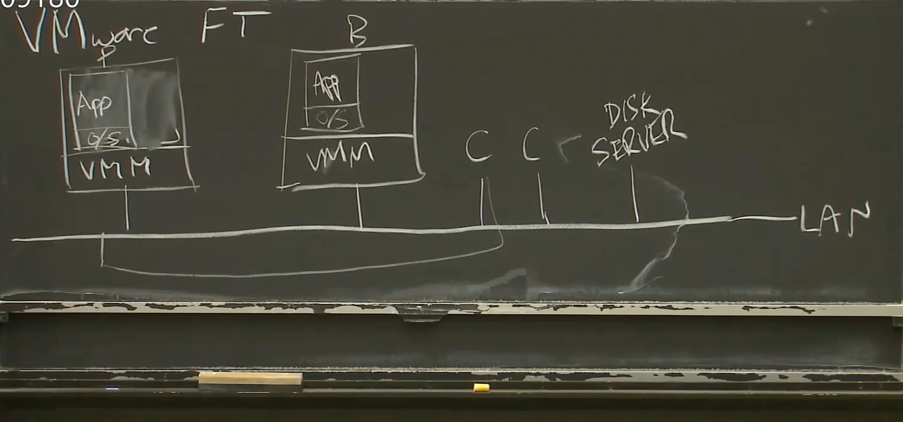

# replication & Fault Tolerance & Server

期望处理fail-stop faults

 ## 方式

state transfer

> 将primary的所有状态state发给backup，例如内存

**replicated state machine**

> 复制某些内部输入或事件  Operation
>
> 送外部操作，而不是state

  

## 同步紧密程度

### WHAT STATE？

初始化的时候，使用state transfer所有的STATE

之后使用replicated

 

这里的vm的复制是处在机器层面，而不是程序内部

P/B SYNC

CUT-Over

ANOMALIES

New Replica

## VMWARE FT

backup的结果不要，在vmm丢掉

当log channel一段时间没动静时，backup上线 ？

## Non-deterministic events

**log entry** 

> instruction #
>
> type
>
> data 

1. inputs–packet-data+interrupt
2. weird instruction 随机数、获取时间等
3. multi core

TEST ANF SET决定哪一个是主句  网络故障

