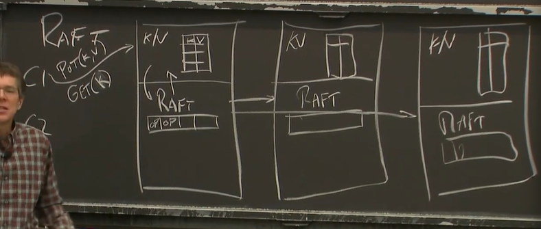
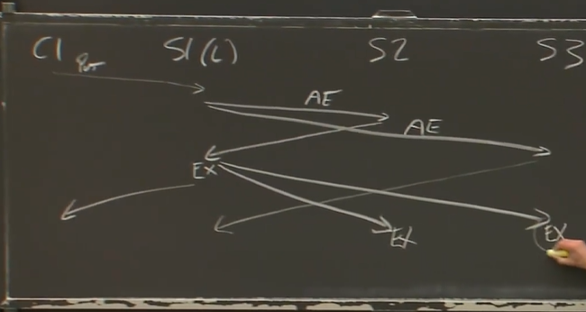

# RAFT 1

"split brain"
需要保证safety

majority vote
少数服从多数 

1. 奇数服务器
1. 能承受少于一半的故障
1. 需要得到大于一般的服务器同意，才能确定操作

在KVserver。table为state

时间序列示意图

## log

相同的  order，相同的 操作

用于暂存操作

持久化，用于重建操作

**怎么知道自己执行到了哪个committed 的entry**

除了leader，别人不能发送 Append Entries

心跳重置选举定时器，虽然每个server的选举超时都是随机的，但是其间隔要大于传输延时，否则可能还是选不出新的leader
每个新的term都应该重置这个时间，

