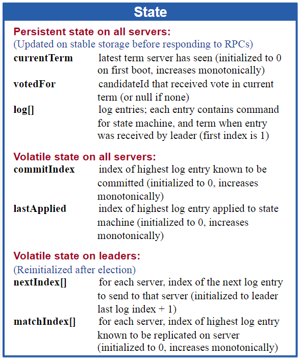
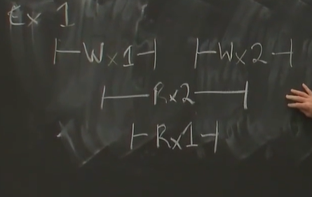
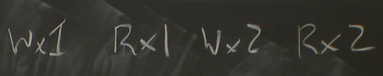

# raft 2

how to become a leader?first candidate

> 投票的过程中会有当前term的信息
>
> > - higher term in last entry
> > - same last term，same or higher index

[raft引入no-op解决了什么问题_raft 新leader 空op-CSDN博客](https://blog.csdn.net/zxpoiu/article/details/115464818)

## fast back up

31分钟左右 [【6.824双语翻译】LEC 7: Fault Tolerance: Raft (2)_哔哩哔哩_bilibili](https://www.bilibili.com/video/BV1pU4y117uv/?spm_id_from=333.880.my_history.page.click&vd_source=d3dafb5faaa2391d25c0cffb421d2fa0)

xterm

## persistent

## snap-shot

减小log长度，防止内存溢出 

**install sanpshot rpcs**

## correctness

这里定义为linearizability

> order

以下是linearizable的吗？

不是，要求一个操作结束再进行另一个操作

