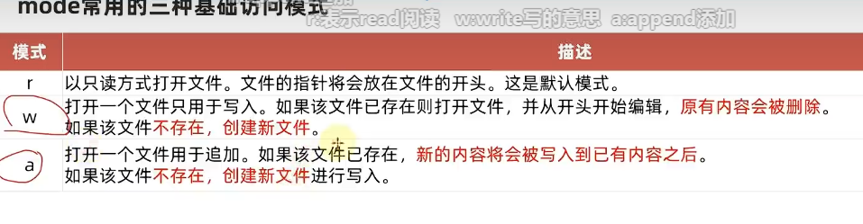

# 编码

UTF-8 一般来说是比较通用的编码


# 文件的操作

打开、关闭、读、写

## 文件打开

`open(name,mode,encoding)`

```py
f=open("python.txt","r",encoding=UTF-8)
```




##  文件的读取

read()

```python
f.read(num)
```

num表示读取数据的长度，单位字节，不写的话读全部

read会接续上次read的位置


readlines()

```python
lists=f.readlines()
```

读取行并保存到列表


readline()

一次读取一行内容


**with open 语法**

with open … as f:

**自动关闭**

```python
with open("python.txt",'r',encoding="UTF-8") as f:
    for line in f:
        print(f'每一行数据为{line}')
        
```


## 文件的写入

使用w打开

open()会创建不存在的文件


f.write("hello")	写入到内存

f.flush()		写入硬盘中文件


close()也会flush


`避免频繁的操作硬盘`

## 文件的关闭

**f.close()**