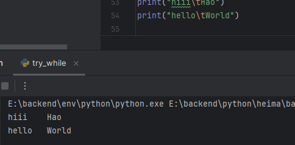

# 基础

while 条件：

​	事件1

​	事件2

​	。。。


注意变量的有效范围

print输出不换行：

> print("hello",end=' ')


特殊字符  \t 可以在多行中对齐，制表符




# for

无法定义循环条件

 ```python
 for 临时变量 in 序列类型:
 	语句
 ```

序列类型：可以被一次去除的类型

1. 字符串
2. 类型
3. 元表
4. 。。。

## rang

获得数字序列

rang(5) **不包括5本身**

得到 [0,1,2,3,4]

rang(4,10) **左闭右开**

得到[ 4,5,6,7,8,9]

rang(num1,num2,num3) num3为**步长**


# break & continue

break **跳出循环**

continue **跳过本次循环**


