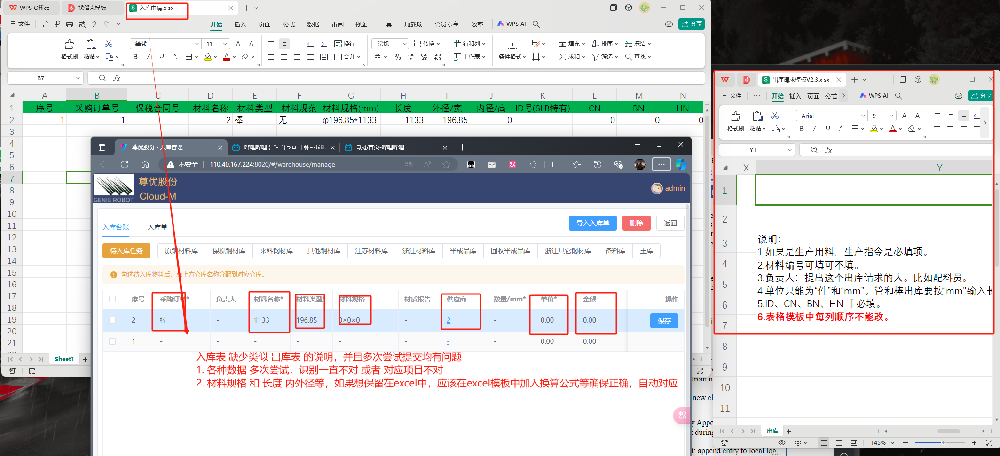
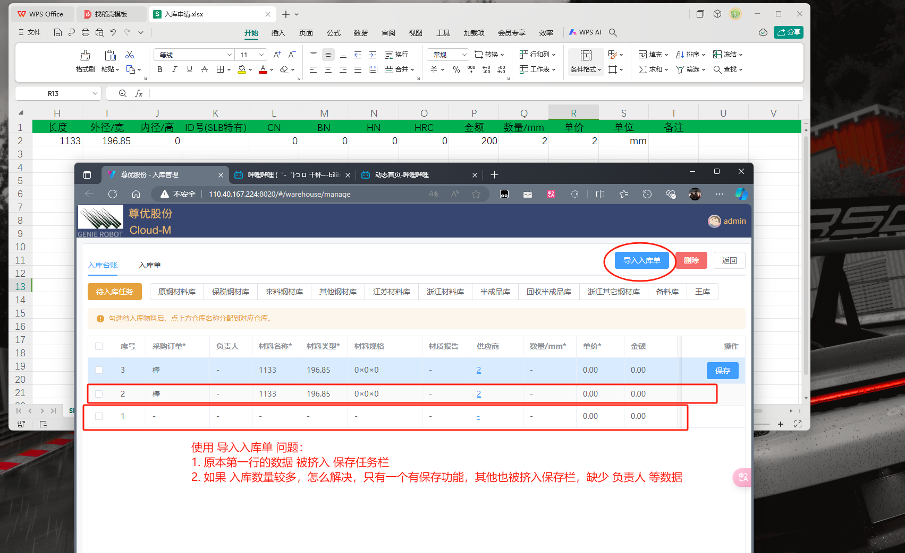

1. 从头开始 测试完整的流程。从仓库设置那开始，对照看看仓库设置有没起效果，仓库设置的结果在仓库材料那和出入库那有没起效果。
2. 然后 出库入库 从 手动输入的方式录入 和导入excle的方式录入数据，到入库出库退料 整个流程走完，包括打印。看中间有没报错，或者有没操作不合适的，或者数据不对的。
3. 某条数据出入库完成后，再到仓库材料里面 看看这条数据的状态和库存数量对不对。

---

## 出库管理-出库台账

### 1. 在已保存的任务栏中**删除 已选定材料的任务**时， 材料 **状态不回到 入库**，而是保持 已选定状态

### 2. 在**第一行** 如果使用 **材料编号 直接搜索**，可以搜索到 所有状态的材料 ，并且可以进行后续所有操作

### 3. 用量 能填负数 ，后续也可以按照 负数 完成出库操作

## 出库管理-出库单

### 1. 库来源 有多个时 检索问题

### 2. 出库单 金额显示问题，出库数量 等于 余量 时，显示金额为0

## 入库管理-入库台账

### 1. 单价 负数输入问题，金额同时也计算到了负数，可以完成入库操作

### 2. 导入入库单 的弹出窗口 缺少下载模板部分（出库单的 上传文件是否要改为 导入出库单）

### 3. 入库表 的识别问题 及 说明文件缺失

### 4. 使用 导入入库表 时任务保存问题

