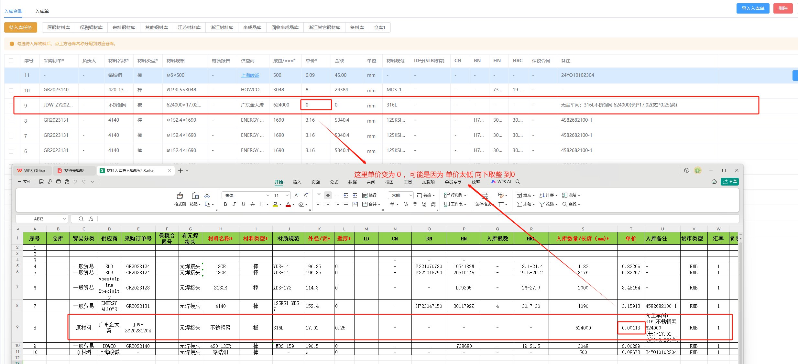
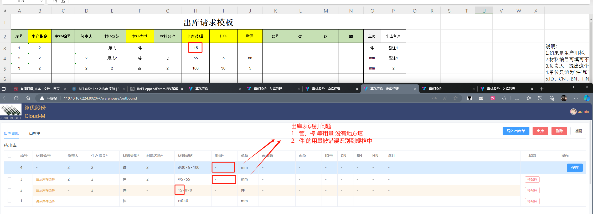
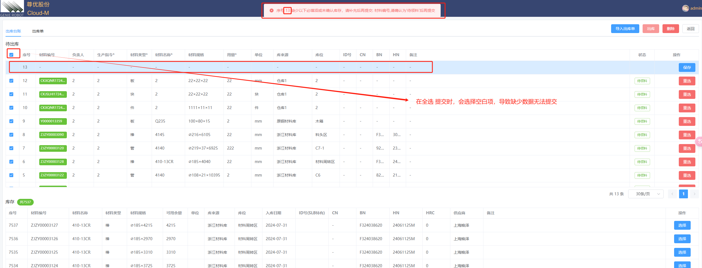
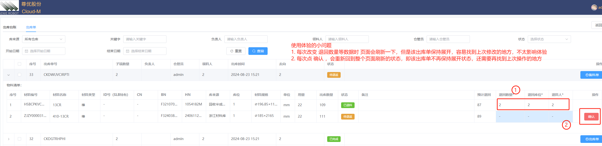
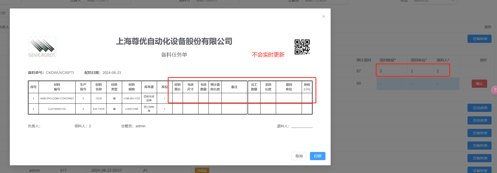
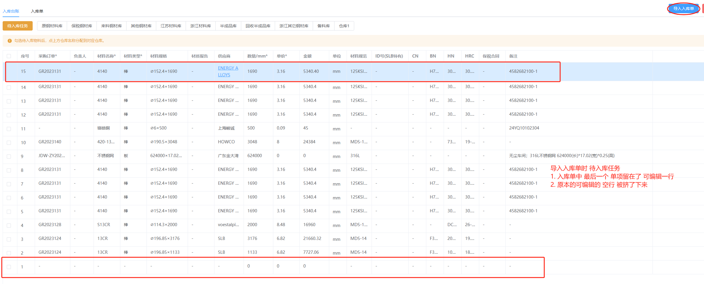

1. 从入库 出库 到退料到结束打印，完整的流程测试看有没问题，问问王博士 有没有真实的表单，用他们真实的数据测试，尽可能模拟交付之后的使用场景 看看流程有没问题。

2. 出库单 入库单 备料单 三个单打印，看看如果条数多了之后，比如30条以上 会不会布局有问题。

---

### 1. 小单价问题

目前后台数据应该做到了 **两位小数 的精度**，这里 单价太低（0.001）直接 向下取整 到0，导致**总价变为0**

### 2. 出库表 识别问题

出库里的任务直接保存，所以用量也应该在出库表中填？

>  **除了 块** 别的材料没地方填 用量

>  **块** 的用量 会错误识别到规格

### 3. 待出库 全选提交问题

**全选** 会**选择到**第一项即**空白项**，导致缺少数据而出错

### 4. 退料时 体验问题

详情见图

### 5. 备料单 更新问题

不会实时更新

### 6. 导入 入库单、出库单 时问题（8.22中已写）

以入库单为例：

原本的第一行 空行 被保存，入库单最后一个 留在了可编辑行

