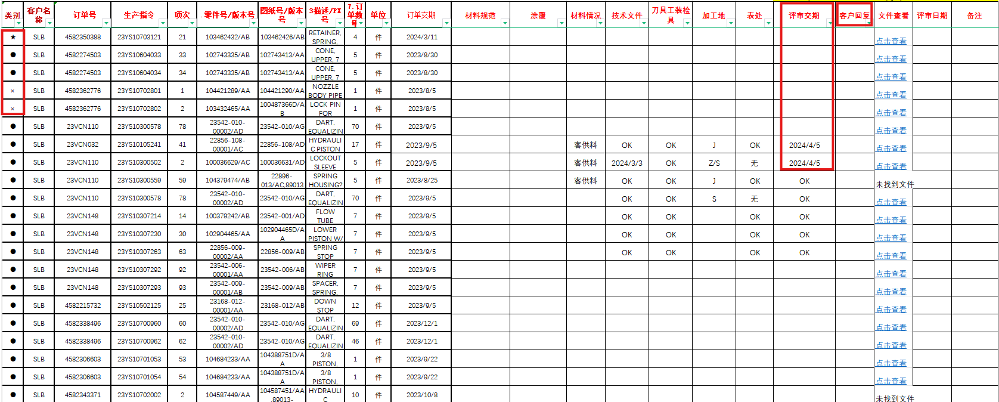
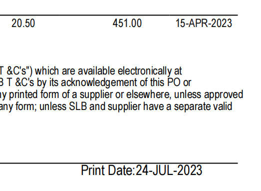

# PO

PO是怎么来的？来源是哪里？

> 算是为斯伦贝谢单独打造

和销售台账sale的关系？

> 评审完加入sale

### 销售跟踪-PO台账

PO一般来说导入即可自动生成，所有字段都会自动识别

没问题的提交评审

### 销售跟踪-PO评审

这里应该时看到评审进度的地方

所需字段

> 客户名称	合同号	项次	单价	总价	技术评审	生产评审	历史价格查阅	评审交期

## PO技术评审

**评审所需文件或数据**：

**评审结果**：

1. 通过

## PO生产评审

**评审所需数据**：

交期

**评审结果**：

1. 通过

---

### 评审表

类别问题、评审交期问题、客户恢复、材料情况

**字段：**
技术文件、刀具工装捡具、加工地、表评审交期、客户回复、文件查看、评审日期

