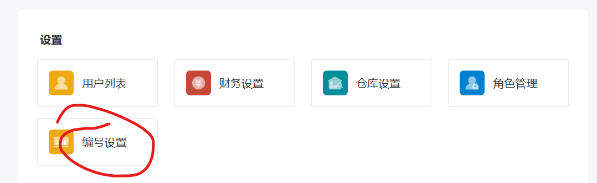
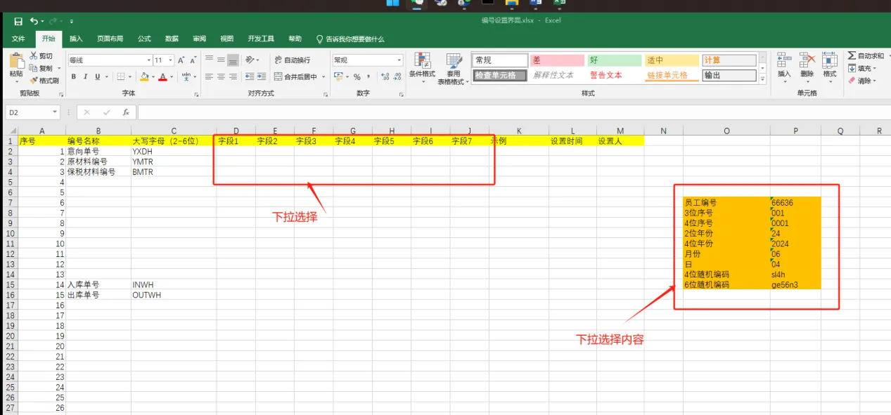

# 基础信息



接口设置：		
`/number/fied/list `：返回编号的字段

需求：



流程：
>需要实现哪些接口？
    仿照仓库设置

    1. field/list 显示所有字段
      2.


1. 接口跳转到控制层 
    在controller新建c_num.go 编写控制层
    
    1. 从前端获取哪些信息？
    common-request中进行记录
    number.go定义结构体
    - 更新编号规则 从请求体中获得form-data表单数据
        numberField结构体除了deleted_at等自动生成的字段

 

2. 模型层
   在服务层 查询 或者进行 校验
    number对应的表结构 numberfield
    |ID（主键）|编号名称（什么单号）|首字符|字段1|字段2|字段3|字段4|字段5|字段6|字段7|示例|设置人|CreatedAt|UpdateAt|DeletedAt|
    |---|---|---|---|---|---|---|---|---|---|---|---|---|---|---|
    |1|意向单号|YXDH||||||||||

    可供选择字段：
    1. 员工编号
    2. 3位序号
    3. 4位序号
    4. 2位年份
    5. 月份
    6. 日
    7. 4位随机编码
    8. 6位随机编码

3. 需要返回哪些信息？
    - 编号名称 -> 获取其大写字母
        eg 意向单号 YXDH
    - 字段1-7
    - 示例
    - 设置时间
    - 设置人

# 接口设置

```go
		apiAuth.GET("/number/field/list", controller.NumberListField)      //显示当前规则
		apiAuth.GET("/number/field/add", controller.NumberListAdd)         //增加规则
		apiAuth.GET("/number/field/delete", controller.NumberFieldDelete)  //删除规则
		apiAuth.POST("/number/field/update", controller.NumberFieldUpdate) //更新规则
		apiAuth.GET("/number/field/Name", controller.NumberTypeList)       //获取所有存在的规则名称
		apiAuth.GET("/number/field/type", controller.NumberCusList)        //获取可选自定义字段
```

# 7.8改进

系统中有哪些编号规则

1. **意向单号** order OrderCreate 

2. ContractAdd **合同号**

3. 合同中 **版本号 图纸号** 手动输入？

4. **出库账单编号 **WarehouseOut

5. **入库单号** InWarehouse

6. **材料单号** 现在没有新增逻辑 AssignLocation       对应表 ImmsWarehouseIn  

   1. 原钢、保税、来料等等仓库 *怎么进行区分

      各种材料的编号规则是单独设置的，但是存储的表格在一块儿，问题就在于读取每月账单的问题上，

      解决方法：

      > 1. 将请求时将材料的种类写入到context上下文中，识别到为材料单号时，自动获取
      > 2. 直接通过SprintNumber的n选择

7. **销售台账** PoCreate没有新增逻辑

8. **生产指令** ？Product Order

9. ~~销售列表 中 合同号~~

10. **送货单** sale_transport  单号规则待确认

11. **不合格品台账** UnqualifiedListAdd


**原来的逻辑依旧使用，使用空壳规则，只有在调用生成编号接口时生成正确编号**

生成示例的为response.getres         生成正确编号的为s_number.go 中SprintNumber


添加编号生成接口

> ```go
> func SprintNumber(n int, c *gin.Context) string
> ```
>
> 位于s_number.go


是否需要通过interface实现

> m_number中定义Num接口，对应的model需要实现getNumber方法


写进服务层？？ s_number


1. 根据？？（账单名，对应id，url中信息）查询**生成规则**

2. 查询 **本月第几单** 在model中进行interface定义 m_number.go  Num接口 需要 **db接口**

   

| ID   | 规则     | 首字母 | cust1    | cust2   | cust3   | cust4   | cust5 |
| ---- | -------- | ------ | -------- | ------- | ------- | ------- | ----- |
| 1    | 意向账单 | 前缀   | 员工编号 | 2位年份 | 2位月份 | 3位序号 |       |
| 2    | 材料单号 |        |          |         |         |         |       |
|      |          |        |          |         |         |         |       |


