10：29	 通道2  低压高压 打不动   **泄压阀问题**

14：27    通道2 掉压快

14：37通道2 打完压 压力会回升

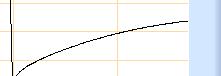

15：15  通道2 第一次 出现压力跌落。保压稳定

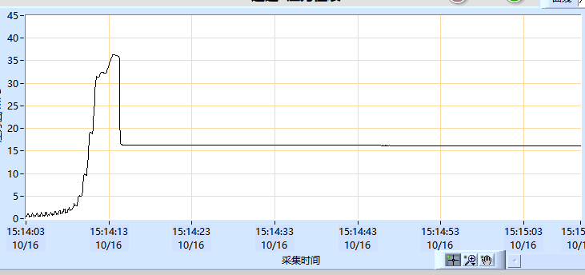

15：25  通道2  压力达到预设值后掉落快，大约十秒钟后趋于稳定

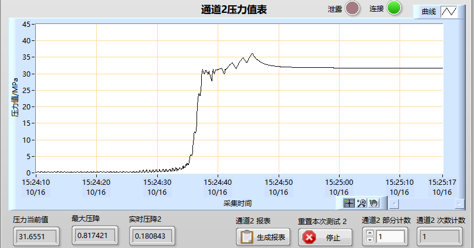

**拧紧管路后不再出现上述问题**

----------------

10.16 出现上述现象 低压问题？ 通道2

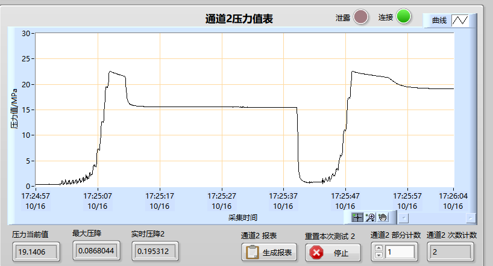

通道2 低压降压快 并且停止后有回升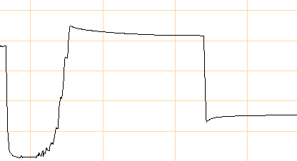

用完低压第二次接着用高压

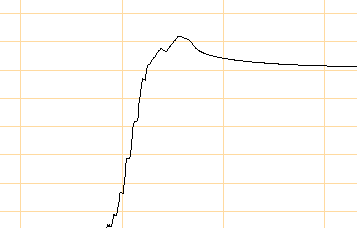

每次都是第二次就没问题，每个第一次都有问题

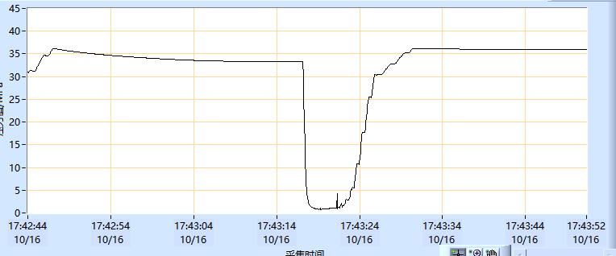

> [!IMPORTANT]
>
> 可能问题：
>
> **通道2的低压阀有问题**，但是只有第一次的时候会稳不住压
>
> ​	暂时没找到原因

# 手动测试

## 通道2

**手动控制 低压：** 初始稳不住压

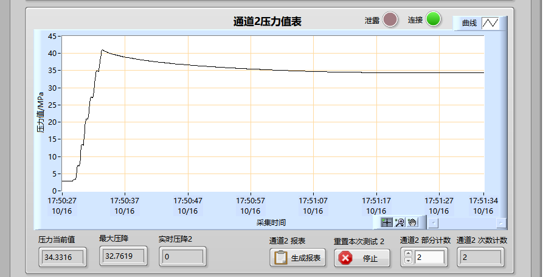

低压反弹

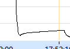

**手动 高压：** 能稳住压

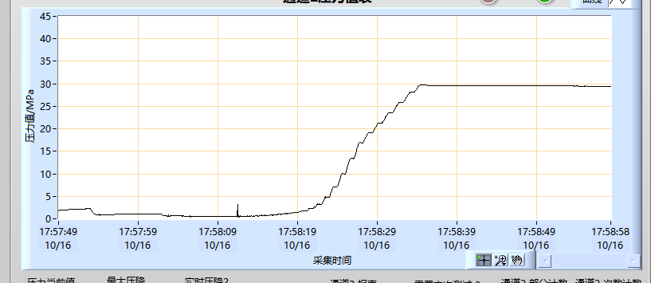

反弹也有

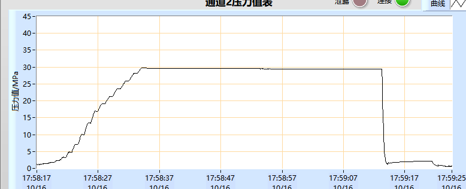

> 通道2低压阀有问题
>
> 手动高压几乎不会掉

## 通道一测试

自动 **低压**没问题 能稳住压

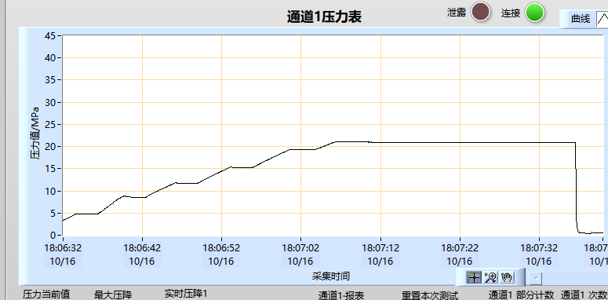

**自动高压**： 也没太有问题 能稳住

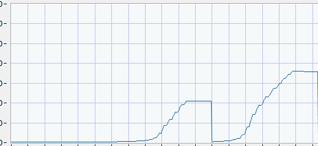

**手动 低压**也没问题 能稳住

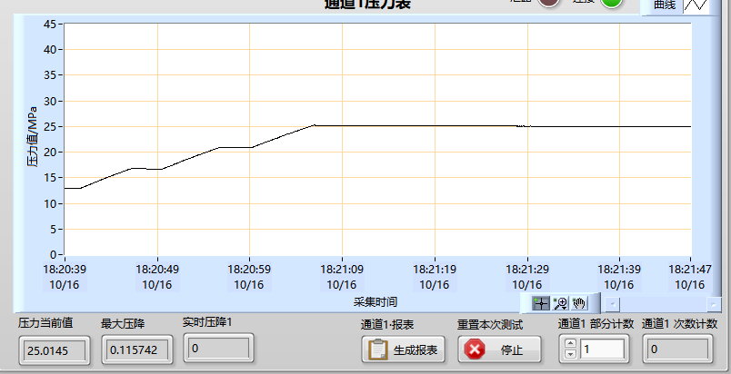
