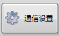

## 使用流程

### 1. 准备配置文件，双击打开可执行应用程序

> [!NOTE]
>
> 配置文件保存有初始的通信设置以及预设信息，如果缺失的话稍后需要在通信设置界面进行**初始化**

### 2. 点击**向右箭头**开始运行程序

程序等待面板如下图，开始**连接PLC**

进入以下两种情况之一

<table frame=void>
	<tr>
        <td>

	
        	
        	 	<!--换行-->
        	连接错误	<!--标题1-->
        

</td>    
     	<td>

	<!--第二张图片-->
    		
    		 
    		PLC连接成功
        

</td>
	</tr>
</table>

> 连接**错误**请检查PLC是否出错等，确保无误后再重新运行本程序
>
> 连接**成功**则跳转到**加压设置界面**，进行下一步
>
> 

### 3. 选择或新建预设

该界面会显示预设相关信息及操作

**初次**使用本程序没有预设，**点击新建预设**，在**加压预设列表**中，会增加自定义1预设，可在重命名窗口进行预设改名

**修改预设操作示意：**

下面为加压设置界面的操作逻辑：

### 4. 点击**显示页面**按钮，跳转到对应页面

> **其左侧主要包含3个小窗口**
>
> 1. ***PLC连接状态***
>    可以显示当前与PLC的实时连接，并有心跳提示
>
> 2. ***切换窗口***
>
>    - *通信设置* 为设置与PLC通信的地址，非工程师确认不要修改
>    - *修改预设* 即回到第三步
>    - *历史记录* 可以根据保存文件查看历史加压曲线
>
>    > 跳转到 修改预设 和 通信设置 都需要填写密码，设置为 123
>
> 3. ***运行过程信息***
>
>    - 右上角显示当前 <u>预设名称</u>
>
>    - 预设名称下方为 <u>选择通道值</u>
>
>    - 中间是 <u>状态记录日志</u>，其会以 <u>txt文件形式</u> 保存到程序同级目录下，<u>每月自动新建</u> 新的日志文件，名称样式如下：，其包含初始化、修改设置等程序运行过程中的操作信息。
>
>      > [!IMPORTANT]
>      >
>      > 只有使用本页面右上角的来退出程序时才能正常保存日志文件！
>
>    - 下面的虚拟LED灯则直观表示 <u>当前设备的运行信息</u> ，当然在状态记录也能看到相关信息

## 其他页面介绍等相关事项

### 文件相关

> [!CAUTION]
>
> 配置文件
>
> ​	如果在新设备上使用**直接拷贝配置文件目录**至程序所在目录即可直接使用原配置，包括预设等y信息都能移至新设备，进行无缝切换，无需繁琐配置
>
> 
>
> 数据记录
>
> ​	数据记录目录 用于 保存历史压力曲线
>
> ​	其格式如下
>
> ​	由 ***通道名称 + 年份 + 月份 + 日期 + 时间*** 来组成，每次打开程序都会新建文件
>
> ​	在历史曲线模块，通过打开后缀为 **tdm** 的文件来加载历史曲线
>
> 
>
> 预设密码为 123

### 通信设置

用于显示与PLC通信的**数据地址、通道**等信息，保存在配置文件中

> 通过在显示页面点击 进入
>
> 这里的设置**修改即保存**，请谨慎操作

### 查看历史页面

可以同时打开两个记录文件，在两个窗口分别显示信息

通过打开后缀为 **tdm** 的文件来加载历史曲线，记录文件相关内容请看 文件相关介绍

> 通过在显示页面点击进入

