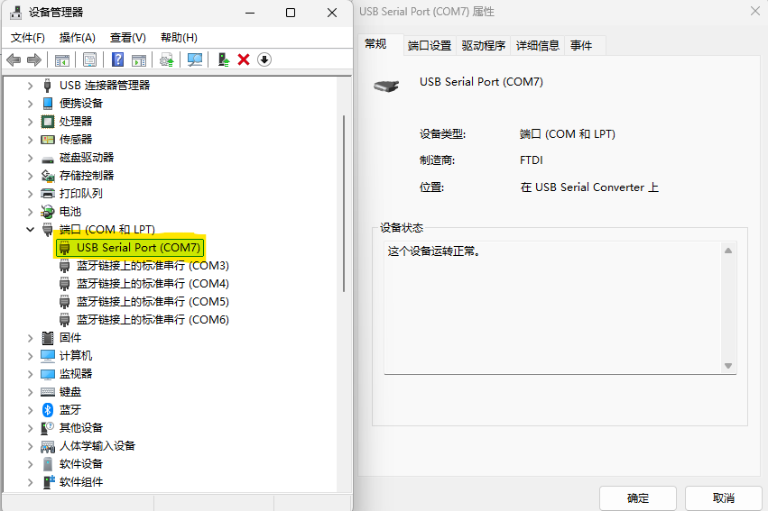
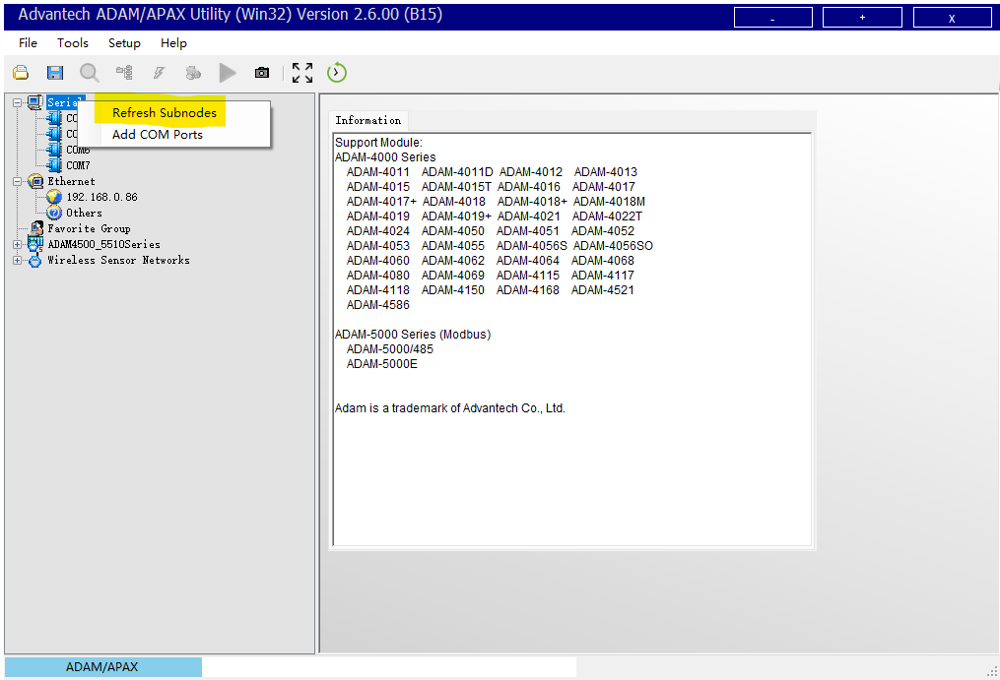
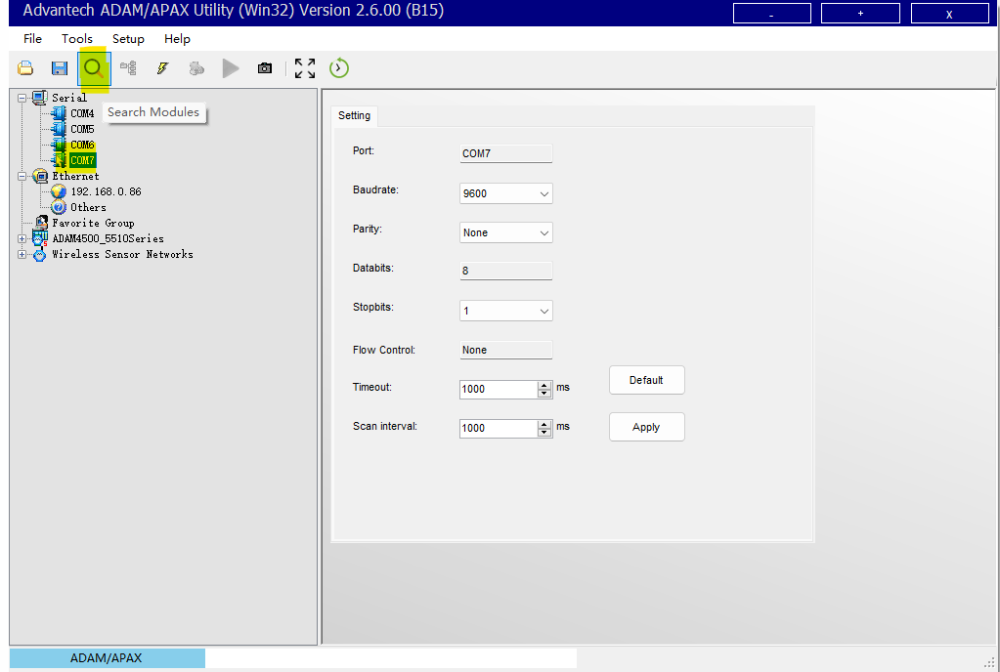
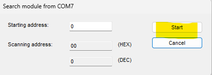
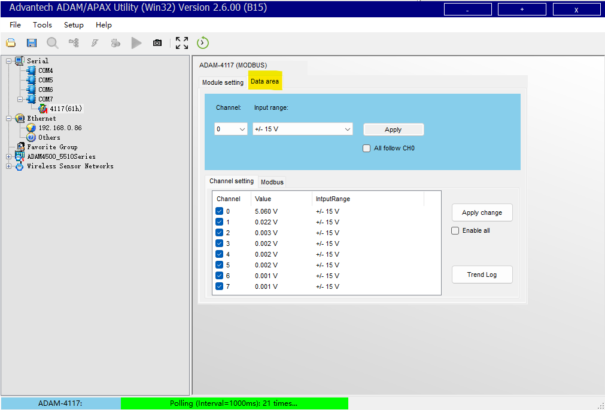

# 配置软件使用

## 下载 

AdamApax .NET Utility 配置实用软件，[下载超链接](https://downloadt.advantech.com/download/downloadsr.aspx?File_Id=1-2CI0QCN)

## 使用
### 找到ADAM4117

打开**设备管理器**，找到ADAM4117所在**端口COM号**，如下图

> 通过反复插拔可以找到确定端口

由于我们使用RS485转RS232转USB串口，如果出现找不到使用的FT232驱动程序，[程序下载超链接](https://www.ftdichip.cn/Drivers/VCP.htm)

### 连接ADAM4117

1. AdamApax .NET Utility界面如下：
   如果没有显示ADAM4117所在端口，如上图在 **Serial 右键**后 左键**点击 Refresh Subnodes**刷新显示端口。

2. **选择**连接到ADAM4117的**端口**，**点击放大镜图标**
   

   > 右侧 setting 中的参数无需改变，除非确认已经修改了 ADAM-4117 的串口通讯参数（例如波特率、数据位等）

3. **点击Start**开始搜索
   
   参数含义是从哪个RS485地址开始搜索，会一直搜索到255

4. 在搜索到的ADAM4117的Data area界面可以直接看到目前的测试信息
   

   > 上面截图中的 *ADAM-4117* 为配置状态，只有初始化状态可以修改波特率和通讯协议等参数。切换初始化状态的开关在模块右侧，拨到**INIT **为初始化状态（配置状态），拨到**Normal**为用户正常使用状态。切换开关的操作必须在模块断电状态下进行才有效。
   >
   > 如果不断电进行切换会通过LED灯显示设备地址号

