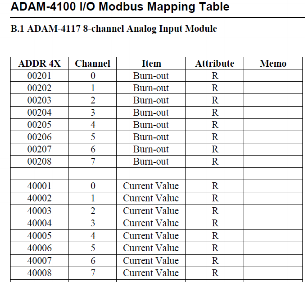
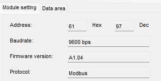

## 注意事项

串口程序安装

[windows 无法安装ft232r usb uart 的解决办法_ft232r usb uart驱动win10-CSDN博客](https://blog.csdn.net/u013767242/article/details/79571463)

切换开关的操作必须在模块断电状态下进行才有效

Modbus RTU 协议

[Modbus RTU 使用教程（modbus教程、modbus协议）（寄存器类型）-CSDN博客](https://blog.csdn.net/Dontla/article/details/134413891?utm_medium=distribute.pc_relevant.none-task-blog-2~default~baidujs_baidulandingword~default-1-134413891-blog-109240555.235^v43^pc_blog_bottom_relevance_base6&spm=1001.2101.3001.4242.2&utm_relevant_index=4)

在Normal模式转到Init模式LED灯会显示地址

# ADAM-4117

16位A/D、8通道模拟量 **输入模块**

> 采集电压、电流等 模拟量输入信号

这张表是关于ADAM-4117模块的Modbus映射表，它展示了如何通过Modbus协议访问设备的特定数据。Modbus是一种通信协议，广泛应用于工业自动化和控制系统中，用于设备之间的数据传输。

------

### 表格解读

这张表格包括以下几列：

1. **ADDR 4X**:
   - 这是Modbus地址，表示Modbus协议中寄存器的地址。地址以“4X”开头，表示这些寄存器是保持寄存器（Holding Register），这是Modbus协议中的一种数据类型。
   - 地址以十进制形式表示，例如00201、00202等。
2. **Channel**:
   - 这是ADAM-4117模块中的通道编号。ADAM-4117是一个8通道模拟输入模块，所以通道编号从0到7。
3. **Item**:
   - 这是Modbus寄存器中存储的数据项。表中列出的数据项有两个：
     - **Burn-out**: 这是一个指示器，用于检测通道是否存在“燃断”情况。燃断是指传感器或电缆断开的情况。
     - **Current Value**: 这是通道的当前输入值，表示传感器的测量数据。
4. **Attribute**:
   - 这是数据属性，表明数据的可读性或可写性。表中所有项的属性都是“R”，表示“只读”（Read-only）。
5. **Memo**:
   - 备注列，通常用于添加额外说明或注释。此表中此列为空。

#### 如何使用该表

- **读取Burn-out状态**:
  - 如果你想检查某个通道是否出现燃断问题，你可以通过Modbus地址00201到00208来读取相应通道的状态。
  - 例如，通过读取地址00201，可以查看通道0的燃断状态。
- **读取通道的当前值**:
  - 如果你想获取某个通道的实时输入值，你可以通过地址40001到40008来读取相应通道的数据。
  - 例如，通过读取地址40001，可以获取通道0的当前测量值。

#### 使用场景

- **工业自动化**: 通过Modbus协议远程监控和读取传感器数据，实现自动化控制和数据采集。
- **设备诊断**: 通过读取燃断状态，可以帮助维护人员快速定位和修复传感器或电缆的问题。

#### 小结

该表格帮助用户理解如何通过Modbus协议与ADAM-4117模块进行交互，获取传感器的状态和数据。用户可以利用这些信息来实现远程监控和控制，确保系统的正常运行。

如果有进一步的问题或需要更多帮助，请随时告诉我

